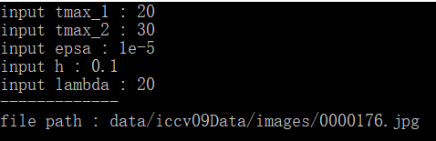
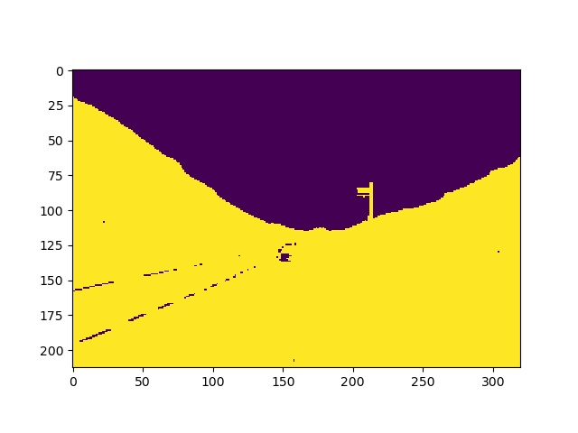

1. 实现了两个版本的WBMS，包括C++和Python，其中，Python用于处理高维数据，C++用于实现图像分割；R语言为WBMS作者实现的代码。github链接：https://github.com/cfuser/WBMS

2. 对n个m维的数据，训练t轮的时间复杂度为$O(tn^2m)$。Python采用调用并行库的方法解决。其优点是清晰明了，缺点是需要$O((240 * 320)^2)$的空间复杂度，并且存在向量的计算慢，复制慢等问题，对于大图像而言，这是难以接受的。C++采用了多线程和向量化的方法加速。对于一个240 * 320的rgb图像而言，训练50个epoch的理论时间复杂度为$O((240*320)^2 * 50 * 3)$，经过加速后可以达到10分钟。其空间复杂度仅需$O(nm)$。对于少量的高维特征数据集，Python速度较快；对于大量的低维特征数据集，C++速度较快。

3. ImageSeg_iccv09.ipynb集成了对比的聚类方法。

4. C++运行截图如下：

   

   Python通过命令行运行：

   ```python
   python run.py --dataset zoo.csv --tmax 30 --_lambda 20 --h 0.1
   ```

5. C++运行环境：opencv, mat

   Python运行环境：matplotlib，numpy，torch，math

6. 实验结果:

   regions.mat是标注数据

   regions_label.jpg是标注类别的可视化

   result.mat是WBMS聚类结果

   res_image.jpg是WBMS聚类结果可视化

   如图所示，左图是人工标注数据，右图是WBMS聚类可视化。


<center class="half">


<center>